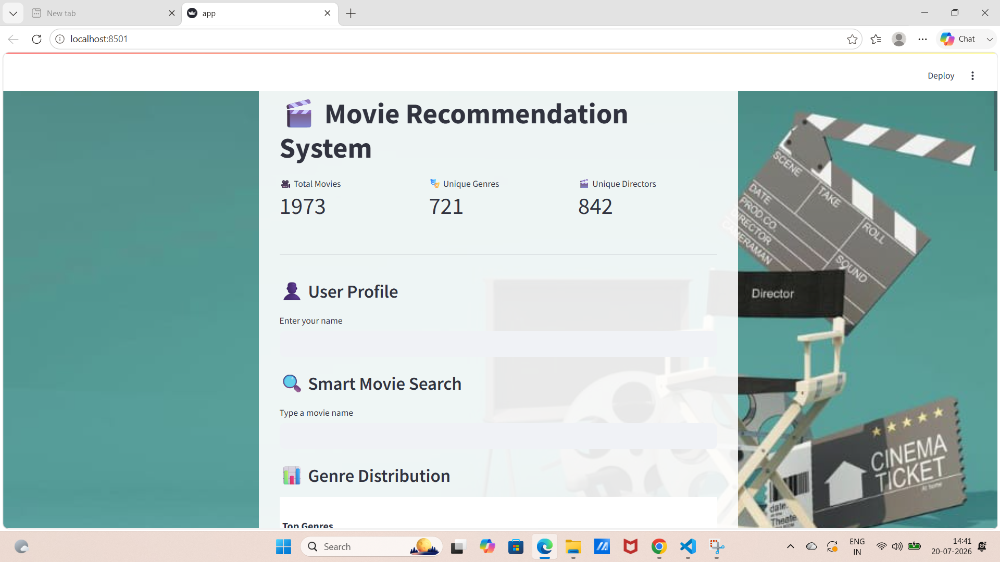
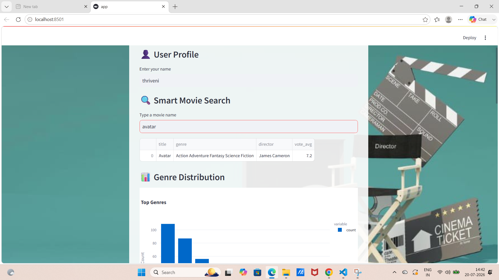
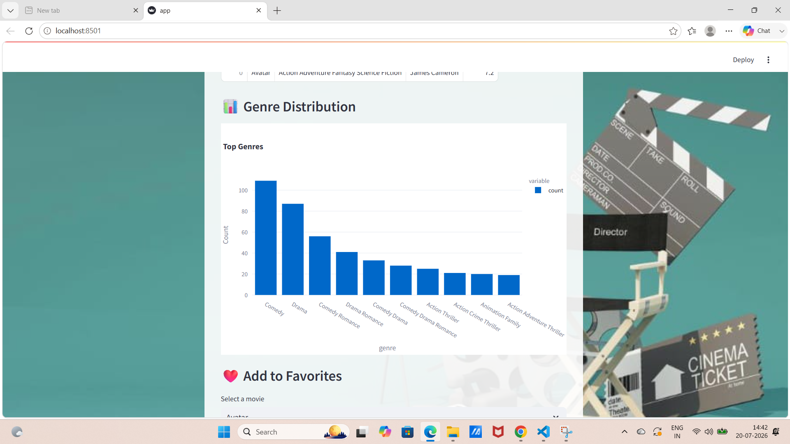
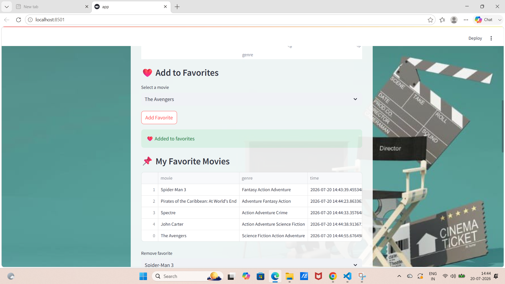
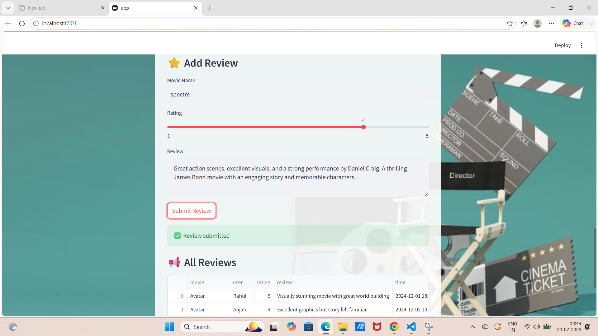

# 🎬 Movie Recommendation System

## 📌 Project Overview

The Movie Recommendation System is an interactive web application developed using **Python** and **Streamlit**. It helps users discover movies through intelligent search and filtering options while providing an engaging and user-friendly interface.

The application allows users to search for movies, explore movie details, manage their favorite movies, submit reviews and ratings, and visualize movie statistics through interactive charts. It demonstrates the practical application of Python, data analysis, visualization, and web application development.

---

## ✨ Features

- 🔍 Smart movie search using fuzzy matching
- 👤 User profile section
- 🎥 Display total movies, genres, and directors
- 📊 Interactive genre distribution chart using Plotly
- ❤️ Add and remove favorite movies
- ⭐ Submit movie ratings and reviews
- 📋 View all submitted reviews
- 🎯 Filter movies by:
  - Rating
  - Popularity
  - Runtime
  - Genre
  - Title
  - Cast
  - Director
- 🎨 Attractive Streamlit interface with a custom background
- 💾 Local data storage using CSV files

---

## 🛠️ Technologies Used

- Python
- Streamlit
- Pandas
- Plotly Express
- Difflib
- HTML
- CSS
- CSV Files

---

## 📂 Project Structure

```
Movie_Application/
│── app.py
│── Movies.csv
│── favorites.csv
│── reviews.csv
│── background.jpg
│── requirements.txt
│── README.md
```

---

## 🚀 Installation

### Clone the repository

```bash
git clone https://github.com/lakshmithriveni196/movie-recommendation-app.git
```

### Navigate to the project folder

```bash
cd movie-recommendation-app
```

### Install the required dependencies

```bash
pip install -r requirements.txt
```

### Run the application

```bash
streamlit run app.py
```

---

## 🎯 How to Use

1. Enter your name in the **User Profile** section.
2. Search for a movie using the Smart Search feature.
3. Browse movie statistics and genre distribution.
4. Filter movies based on different criteria.
5. Add movies to your Favorites list.
6. Submit ratings and reviews for movies.
7. View your favorite movies and all submitted reviews.

---

## 📸 Application Screenshots

### 🏠 Home Page



---

### 🔍 Smart Movie Search



---

### 📊 Genre Distribution



---

### ❤️ Favorites



---

### ⭐ Reviews



---

## 🔮 Future Enhancements

- Movie poster integration using TMDB API
- Personalized recommendation engine
- User authentication and login system
- Cloud database integration
- Watchlist feature
- Online deployment using Streamlit Community Cloud
- Advanced recommendation algorithms

---

## 💡 Learning Outcomes

This project helped in understanding:

- Python programming
- Streamlit web application development
- Data manipulation using Pandas
- Interactive data visualization using Plotly
- File handling with CSV
- Search algorithms using Difflib
- User interface design
- Software project organization

---

## 👩‍💻 Author

**Lakshmi Thriveni**

**B.Tech – Computer Science & Engineering**

### Skills

- Python
- Java
- SQL
- HTML
- CSS
- Streamlit
- Pandas
- Plotly

---

## ⭐ If you like this project

If you found this project useful, consider giving it a ⭐ on GitHub.
